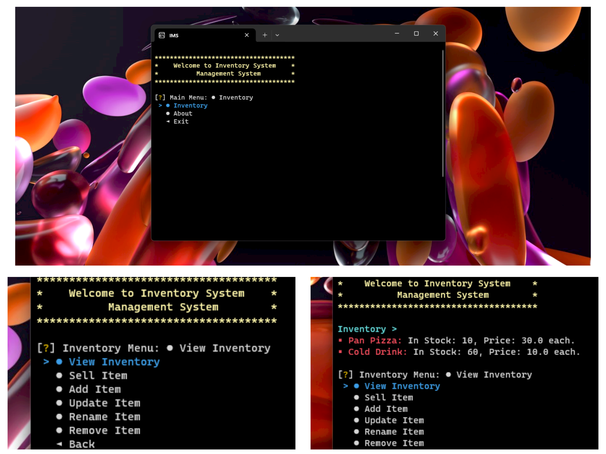

# Inventory Management System 📦

The **Inventory Management System** is a command-line application developed in Python for managing inventory. The application allows users to view, add, sell, update, rename, and remove inventory items, as well as record transactions.



## Features

- **View Inventory:** Display all items in the inventory with their quantities and prices.
- **Sell Item:** Sell items from the inventory and update stock levels.
- **Add Item:** Add new items to the inventory with quantity and price details.
- **Update Item:** Update the quantity and price of existing items.
- **Rename Item:** Rename items in the inventory.
- **Remove Item:** Remove single or multiple items from the inventory.
- **Transaction Recording:** Record all transactions with timestamps in a text file.

## Usage

1. **Run the application:**

   ```bash
   python IMS.py
   ```

2. **Main Menu:**

   - **Inventory:** Navigate to inventory management options.
   - **About:** Display information about the developer.
   - **Exit:** Exit the application.

3. **Inventory Menu:**
   - **View Inventory:** Display all items in the inventory.
   - **Sell Item:** Sell items from the inventory.
   - **Add Item:** Add new items to the inventory.
   - **Update Item:** Update existing items in the inventory.
   - **Rename Item:** Rename items in the inventory.
   - **Remove Item:** Remove items from the inventory.
   - **Back:** Go back to the main menu.

## Functions

### Main Functions

- **MainMenu()**: Displays the main menu and handles navigation.
- **InventoryMenu()**: Displays the inventory menu and handles navigation.
- **ViewInventory()**: Displays the current inventory.
- **SellItemInventory()**: Sells items from the inventory.
- **AddItemInventory()**: Adds new items to the inventory.
- **UpdateItemInventory()**: Updates existing items in the inventory.
- **RenameItemInventory()**: Renames items in the inventory.
- **RemoveItemInventory()**: Removes items from the inventory.
- **ExitApp()**: Exits the application.

### Helper Functions

- **Menu(menutitle, choices)**: Displays a menu with given title and choices.
- **AppText(TextState, animate)**: Displays application text (welcome, exit).
- **cls()**: Clears the console screen.
- **cursor(state)**: Hides or shows the cursor.
- **printc(text, type, fore, back, style, end)**: Prints colored text in the console.
- **RecordTransaction(item, quantity, transaction_type)**: Records a transaction.
- **LoadFile(path, filetype)**: Loads data from a file.
- **SaveFile(path, data, filetype, mode)**: Saves data to a file.

## Installation

1. **Clone the repository:**
   ```bash
   git clone https://github.com/yourusername/Inventory-Management-System.git
   ```
2. **Navigate to the project directory:**
   ```bash
   cd Inventory-Management-System
   ```
3. **Install dependencies:**
   ```bash
   pip install -r requirements.txt
   ```

## File Structure

- `IMS.py`: Main application file.
- `inventory.json`: JSON file to store inventory data.
- `transactions.txt`: Text file to record transactions.

## Dependencies

- `json`
- `time`
- `datetime`
- `inquirer`
- `colr`

Install dependencies using:

```bash
pip install -r requirements.txt
```

## Contributing

Feel free to fork this project, create issues, and submit pull requests. Contributions are welcome!

## License

Distributed under the MIT License. See [LICENSE](https://github.com/itsprs/Inventory-Management-System/blob/main/LICENSE) for more information.

## Author

Designed & Developed by: [Pratham Raj Singh](https://imprs.vercel.app/about)

- GitHub: [@itsprs](https://github.com/itsprs)
- Website: [imprs.vercel.app](https://imprs.vercel.app)
- Blog: [imprs.vercel.app/blog](https://imprs.vercel.app/blog)
- LinkedIn: [imprathamraj](https://www.linkedin.com/in/imprathamraj)
- Instagram: [@im.prs7](https://www.instagram.com/im.prs7)
- Twitter: [@im_prs7](https://x.com/im_prs7)
